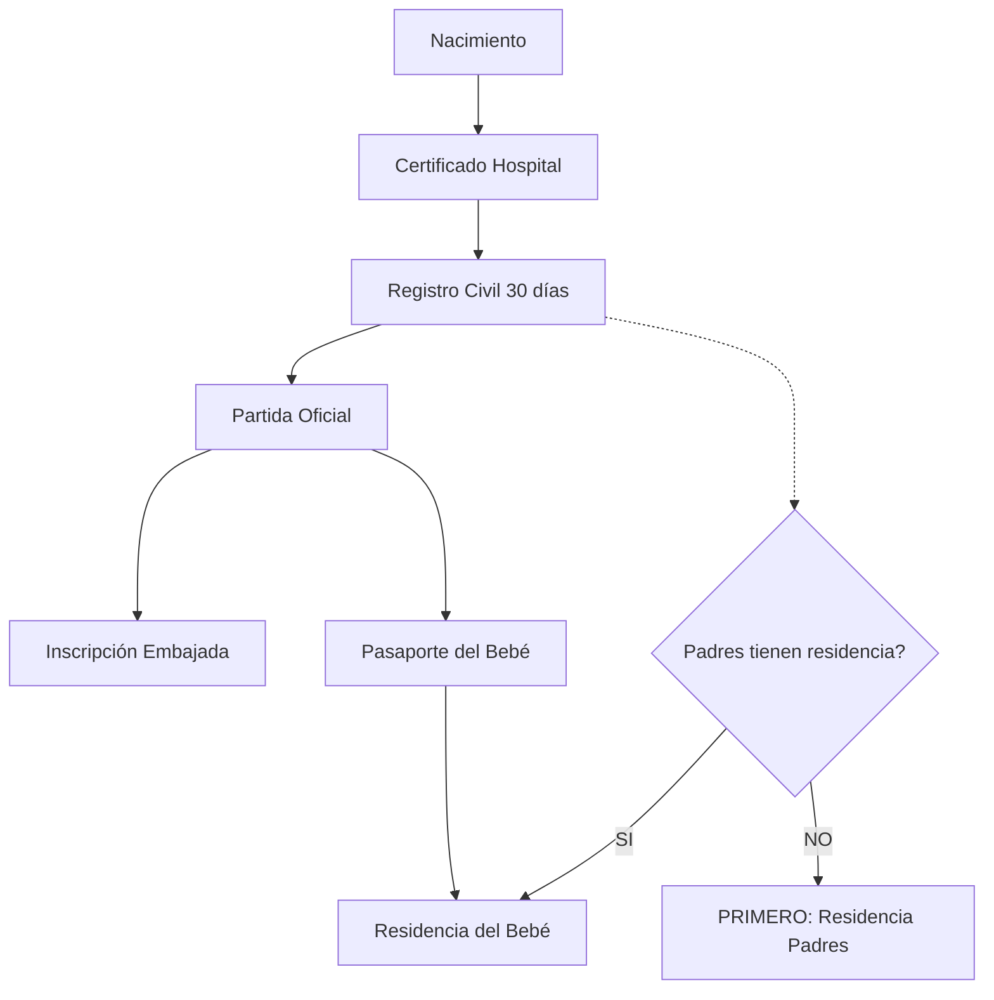
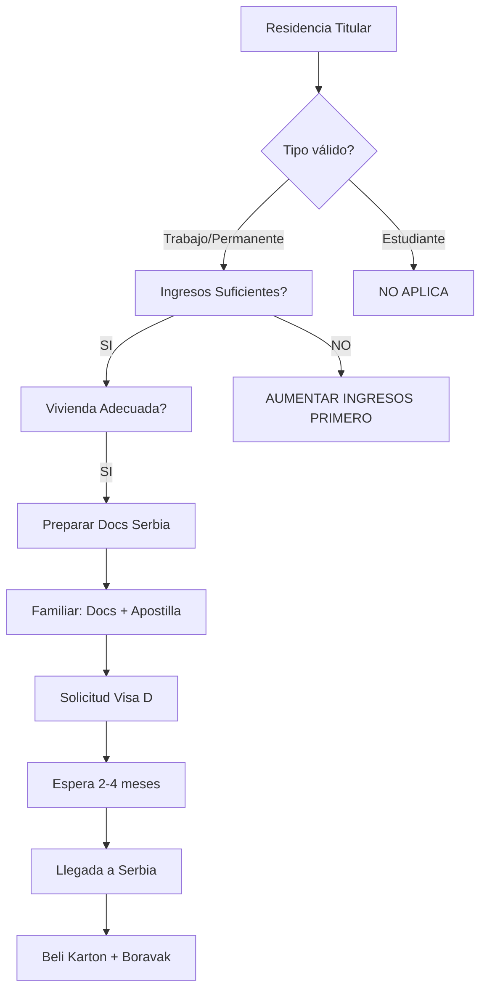

# Módulo RESIDENCIA - Flujo Funcional Completo

> **⚠️ FUENTES OFICIALES:** Este documento se basa en fuentes verificadas registradas en [`data/official_sources.json`](../../data/official_sources.json).
> Última verificación: Ver archivo JSON.


## Arquitectura del Flujo

### 1. Motor de Prioridad Contextual (MPC)

El MPC analiza la entrada del usuario y detecta:

```
ENTRADA DEL USUARIO
       ↓
┌──────────────────┐
│ Análisis de      │
│ Intención        │
└──────────────────┘
       ↓
┌──────────────────┐
│ Detección de     │
│ Urgencia         │
└──────────────────┘
       ↓
┌──────────────────┐
│ Evaluación de    │
│ Riesgo           │
└──────────────────┘
       ↓
┌──────────────────┐
│ Mapeo de         │
│ Dependencias     │
└──────────────────┘
```

#### Ejemplos de Detección Contextual

**Caso 1: "Mi hijo nació en Serbia"**
- **Intención**: Inscripción de nacimiento
- **Urgencia**: ALTA (plazo de 30 días)
- **Riesgo**: Pérdida de documentación automática
- **Dependencias**: Residencia de padres, documentos civiles

**Caso 2: "Mi residencia vence en 10 días"**
- **Intención**: Renovación urgente
- **Urgencia**: CRÍTICA (menos de 15 días)
- **Riesgo**: Estancia ilegal, multas
- **Dependencias**: Motivo de residencia, documentos actualizados

**Caso 3: "¿Puedo traer a mi familia?"**
- **Intención**: Reagrupación familiar
- **Urgencia**: MEDIA
- **Riesgo**: Requisitos económicos no cumplidos
- **Dependencias**: Tipo de residencia actual, ingresos

---

## 2. Flujo: NACIMIENTO EN SERBIA

### Punto de Entrada
```
Usuario dice:
- "Mi hijo nació en Serbia"
- "Dónde registro el nacimiento"
- "Necesito partida de nacimiento"
```

### Detección MPC
```javascript
{
  intención: "inscripción_nacimiento",
  urgencia: "ALTA",
  plazo_límite: "30 días desde nacimiento",
  riesgo_principal: "pérdida_documentación_automática",
  dependencias: [
    "residencia_padres",
    "certificado_hospital",
    "documentos_identidad_padres"
  ]
}
```

### Guardian - Alertas Preventivas
1. **🚨 Plazo Crítico**: Tienes 30 días desde el nacimiento para inscribirlo. Después, el proceso se complica.
2. **📄 Guarda Todo**: El certificado del hospital (porodilište) es VITAL. No lo pierdas.
3. **⚖️ Doble Nacionalidad**: Si tus hijos pueden tener tu nacionalidad, inscríbelo también en tu embajada.

### COR - Pasos Claros

#### Paso 1: Inmediato (En el Hospital)
```
🏥 EN EL HOSPITAL (PRIMER DÍA)
→ Solicita el "Potvrda o rođenju" (Certificado de Nacimiento Hospitalario)
→ Es un papel amarillo/blanco que entrega el hospital
→ SIN este papel, NO puedes hacer nada más
```

#### Paso 2: Registro Civil (Primeros 30 días)
```
📍 MATIČNI URED (Oficina de Registro Civil)
→ Ve a la oficina del municipio donde nació el bebé
→ Lleva:
   ✓ Potvrda o rođenju (certificado del hospital)
   ✓ Pasaportes de ambos padres
   ✓ Tu residencia en Serbia (Boravak/Beli Karton)
   ✓ Certificado de matrimonio (si aplica)

Resultado: Recibes el "Izvod iz matične knjige rođenih" (Partida de Nacimiento Oficial)
```

#### Paso 3: Embajada (Si aplica nacionalidad de origen)
```
🏛️ TU EMBAJADA
→ Inscribe al bebé en tu embajada para que tenga tu nacionalidad
→ Lleva:
   ✓ Partida serbia (Izvod)
   ✓ Pasaportes de los padres
   ✓ Certificado de matrimonio
   
Resultado: Tu hijo tiene doble nacionalidad
```

#### Paso 4: Residencia del Bebé
```
👶 RESIDENCIA DEL BEBÉ EN SERBIA
→ Si planeas quedarte, el bebé necesita su propia residencia
→ Ve a la policía (MUP) con:
   ✓ Partida de nacimiento serbia
   ✓ Pasaporte del bebé (de tu país)
   ✓ Tu residencia vigente
   ✓ Comprobante de alojamiento

Resultado: El bebé tiene "Boravak" (permiso temporal) vinculado a tus padres
```

### Dependencias Críticas


### Fuentes Oficiales
- **Registro Civil**: https://www.mpravde.gov.rs (Ministerio de Justicia)
- **Residencia Infantil**: https://www.mup.gov.rs/wps/portal/sr/dokumenti/stranci
- **Info General**: https://welcometoserbia.gov.rs/family

---

## 3. Flujo: RENOVACIÓN URGENTE

### Punto de Entrada
```
Usuario dice:
- "Mi residencia vence pronto"
- "Me caduca el permiso"
- "Tengo 10 días"
```

### Detección MPC
```javascript
{
  intención: "renovación_boravak",
  urgencia: dias_restantes <= 15 ? "CRÍTICA" : "ALTA",
  riesgo_principal: "estancia_ilegal",
  dependencias: [
    "motivo_original",
    "documentos_actualizados",
    "comprobante_alojamiento"
  ]
}
```

### Guardian - Sistema de Semáforo
```
🔴 MENOS DE 7 DÍAS
→ ZONA ROJA: Riesgo de multa y deportación
→ Acción: Ve HOY a la policía (MUP) con lo que tengas
→ Pide extensión de emergencia

🟡 7-15 DÍAS
→ ZONA AMARILLA: Todavía hay tiempo pero ACTÚA YA
→ Acción: Reúne documentos HOY, agenda cita MAÑANA

🟢 MÁS DE 15 DÍAS
→ ZONA VERDE: Tiempo suficiente para hacerlo bien
→ Acción: Revisa requisitos, prepara documentos con calma
```

### COR - Pasos por Tipo de Residencia

#### Renovación: Residencia Temporal (Privremeni Boravak)
```
📋 DOCUMENTOS NECESARIOS
✓ Solicitud formal (se llena en la policía)
✓ Pasaporte válido (mínimo 6 meses)
✓ Residencia actual (la que vas a renovar)
✓ Comprobante del motivo:
  - Trabajo: Contrato vigente + permiso de trabajo
  - Estudios: Carta de la universidad
  - Familia: Certificado de matrimonio/nacimiento
✓ Seguro médico privado
✓ Comprobante de alojamiento (Beli Karton actualizado)
✓ Comprobante de pago (tasa administrativa ~6000 RSD)

🏢 DÓNDE IR
→ MUP (Policía de Extranjería) de tu ciudad
→ Belgrado: Savska 35
→ Novi Sad: Bulevar Mihajla Pupina 25

⏰ PLAZO
→ Debes solicitar 30 días ANTES del vencimiento
→ Recibes respuesta en 30-60 días
```

### Dependencias Críticas
```
RENOVACIÓN DE BORAVAK
       ↓
┌─────────────────────┐
│ ¿Motivo sigue       │
│ vigente?            │
└─────────────────────┘
       ↓
    SI │      NO → CAMBIAR MOTIVO (proceso distinto)
       ↓
┌─────────────────────┐
│ ¿Documentos         │
│ actualizados?       │
└─────────────────────┘
       ↓
    SI │      NO → ACTUALIZAR PRIMERO
       ↓
┌─────────────────────┐
│ Solicitar           │
│ Renovación          │
└─────────────────────┘
```

---

## 4. Flujo: REAGRUPACIÓN FAMILIAR

### Punto de Entrada
```
Usuario dice:
- "Quiero traer a mi familia"
- "¿Puedo traer a mi esposa?"
- "Mis hijos pueden venir?"
```

### Detección MPC
```javascript
{
  intención: "spajanje_porodice",
  urgencia: "MEDIA",
  riesgo_principal: "requisitos_económicos_insuficientes",
  dependencias: [
    "tipo_residencia_actual",
    "ingresos_demostrables",
    "vivienda_adecuada",
    "vinculo_familiar_probado"
  ]
}
```

### Guardian - Requisitos Previos
```
⚠️ ANTES DE EMPEZAR
1. TÚ debes tener residencia temporal o permanente VIGENTE
2. Debes demostrar ingresos suficientes:
   - Por cónyuge: ~60.000 RSD/mes
   - Por hijo menor: +30.000 RSD/mes adicional
3. Debes tener vivienda adecuada (mínimo m² por persona)
4. NO puedes estar en residencia de estudiante (solo trabajo/emprendimiento/familia)
```

### COR - Proceso Completo

#### Fase 1: Preparación en Serbia (Tú)
```
📍 EN SERBIA (EL QUE YA ESTÁ)
→ Obtén "Potvrda o boravku" (Certificado de Residencia)
   └─ Se pide en la policía (MUP)
   └─ Necesitas: Residencia vigente, pasaporte
   
→ Obtén comprobante de ingresos:
   └─ Contrato de trabajo + últimas 3 nóminas
   └─ O certificado bancario de ingresos
   
→ Obtén comprobante de vivienda:
   └─ Contrato de alquiler notarizado
   └─ O escritura si es propia
```

#### Fase 2: Documentos del Familiar (En su país)
```
🌍 EN EL PAÍS DE ORIGEN
→ Partida de nacimiento/matrimonio apostillada
→ Certificado de antecedentes penales apostillado
→ Pasaporte vigente (mínimo 6 meses)
→ Seguro médico para Serbia (privado)
→ Fotografías biométricas
```

#### Fase 3: Solicitud de Visa D (En Embajada Serbia)
```
🏛️ EMBAJADA DE SERBIA (en el país del familiar)
→ Solicitud formal de Visa D (larga estancia)
→ Entregar todos los documentos
→ Entrevista consular
→ Pago de tasa (~100-150 EUR)

⏰ Tiempo de espera: 2-4 meses
```

#### Fase 4: Llegada y Residencia (En Serbia)
```
🛬 AL LLEGAR A SERBIA (primeros 3 días)
→ Ir a la policía local para hacer el Beli Karton
→ Después (30 días), solicitar "Privremeni Boravak po osnovu spajanja porodice"
→ Documentos:
   ✓ Visa D
   ✓ Pasaporte
   ✓ Todos los documentos apostillados
   ✓ Certificado de residencia del familiar en Serbia
   ✓ Comprobantes económicos
   ✓ Seguro médico
```

### Dependencias Críticas


### Fuentes Oficiales
- **Reagrupación**: https://www.mup.gov.rs/wps/portal/sr/dokumenti/stranci
- **Visas**: https://www.mfa.gov.rs/en/consular-affairs/visas
- **Info General**: https://welcometoserbia.gov.rs/family

---

## 5. Arquitectura de Integración con Guardian Standard

### Relación con Estados Existentes

El módulo RESIDENCIA se conecta con el Guardian Standard existente:

```
GUARDIAN STANDARD (Congelado)
       ↓
┌──────────────────┐
│ just_arrived     │ → Redirige a "Primera Residencia" si no tiene
│ legal_clock      │ → ACTIVA módulo RESIDENCIA (renovación urgente)
│ housing_stability│ → Vincula con "Reagrupación" (vivienda adecuada)
│ admin_block      │ → Si rechazo es de residencia, redirige aquí
└──────────────────┘
       ↓
MÓDULO RESIDENCIA (Nuevo)
```

### Regla de No-Duplicación

- ❌ NO duplicar alertas del Guardian sobre Beli Karton
- ❌ NO crear nuevo estado "residencia_familiar" (usar housing_stability)
- ✅ SÍ referenciar estados existentes
- ✅ SÍ añadir contenido específico de familia/nacimiento (no cubierto)

---

## 6. Mapa Mental Completo

```
RESIDENCIA
├── PRIMERA VEZ
│   ├── Por Trabajo
│   ├── Por Estudios
│   └── Por Familia
│       └── → Módulo Familia (este documento)
│
├── RENOVACIÓN
│   ├── Temporal → Temporal
│   ├── Temporal → Permanente
│   └── URGENTE (< 15 días) ← Guardian activo
│
├── FAMILIA
│   ├── NACIMIENTO EN SERBIA
│   │   ├── Inscripción Civil (30 días)
│   │   ├── Inscripción Embajada
│   │   ├── Pasaporte Bebé
│   │   └── Residencia Bebé
│   │
│   ├── REAGRUPACIÓN
│   │   ├── Requisitos Previos
│   │   │   ├── Tipo Residencia Válida
│   │   │   ├── Ingresos Suficientes
│   │   │   └── Vivienda Adecuada
│   │   ├── Proceso
│   │   │   ├── Docs Serbia
│   │   │   ├── Docs País Origen
│   │   │   ├── Solicitud Visa D
│   │   │   └── Llegada + Boravak
│   │   └── Tiempos: 2-4 meses
│   │
│   └── CASOS ESPECIALES
│       ├── Divorcio con hijo serbio
│       ├── Fallecimiento de titular
│       └── Custodia compartida
│
└── CAMBIO DE MOTIVO
    ├── Estudiante → Trabajo
    ├── Trabajo → Familia
    └── Temporal → Permanente
```

---

## 7. Implementación Técnica (Propuesta)

### Estructura de Datos

```javascript
const RESIDENCY_FLOWS = {
  "birth_in_serbia": {
    id: "birth_in_serbia",
    keywords: ["nació", "nacimiento", "bebé", "hijo", "partida", "porodilište"],
    urgency_triggers: {
      days_since_birth: {
        0-15: "MEDIA",
        16-25: "ALTA",
        26-30: "CRÍTICA"
      }
    },
    steps: [...], // Como se definió arriba
    official_sources: [
      "https://www.mpravde.gov.rs",
      "https://welcometoserbia.gov.rs/family"
    ]
  },
  
  "renewal_urgent": {
    id: "renewal_urgent",
    guardian_trigger: "legal_clock", // Se activa desde estado existente
    urgency_triggers: {
      days_until_expiry: {
        0-7: "CRÍTICA",
        8-15: "ALTA",
        16-30: "MEDIA"
      }
    },
    steps: [...],
    official_sources: [...]
  },
  
  "family_reunification": {
    id: "family_reunification",
    keywords: ["familia", "esposa", "esposo", "hijos", "traer", "reagrupación"],
    prerequisites: {
      valid_residency_types: ["work", "permanent"],
      minimum_income_per_person: 60000, // RSD
      housing_requirement: true
    },
    steps: [...],
    timeline_months: "2-4",
    official_sources: [...]
  }
};
```

### Lógica de Priorización

```javascript
function detectResidencyContext(userInput, userState) {
  // 1. Detectar intención
  const intention = analyzeIntention(userInput);
  
  // 2. Calcular urgencia
  const urgency = calculateUrgency(intention, userState);
  
  // 3. Evaluar riesgos
  const risks = evaluateRisks(intention, userState);
  
  // 4. Mapear dependencias
  const dependencies = mapDependencies(intention, userState);
  
  return {
    intention,
    urgency,
    risks,
    dependencies,
    recommended_flow: selectOptimalFlow(intention, urgency, risks)
  };
}
```

---

## 8. Casos de Uso Reales

### Caso 1: "Mi hijo nació hace 20 días"
```
MPC Detecta:
→ Intención: inscripción_nacimiento
→ Urgencia: ALTA (quedan 10 días del plazo)
→ Riesgo: Pérdida de inscripción simple

Guardian Alerta:
🚨 "Atención: Te quedan 10 días para inscribir al bebé en el Registro Civil. 
   Después del día 30, necesitarás un proceso judicial."

COR Guía:
→ PASO 1 (HOY): Verifica que tienes el certificado del hospital
→ PASO 2 (MAÑANA): Ve al Matični Ured con:
   • Certificado hospital
   • Pasaportes
   • Tu residencia
→ Enlace oficial: [matični ured más cercano]
```

### Caso 2: "Mi residencia vence en 5 días y no sé qué hacer"
```
MPC Detecta:
→ Intención: renovación_urgente
→ Urgencia: CRÍTICA (menos de 7 días)
→ Riesgo: Estancia ilegal inminente

Guardian Alerta:
🔴 "URGENCIA MÁXIMA: Tu residencia vence en 5 días.
   Ve HOY a la policía con lo que tengas.
   Pide una extensión de emergencia mientras reúnes documentos."

COR Guía:
→ ACCIÓN INMEDIATA:
   1. Ve HOY a MUP Savska 35 (Belgrado)
   2. Explica tu situación
   3. Lleva: pasaporte + residencia actual + motivo (contrato/carta)
   
→ DESPUÉS (si te dan extensión):
   • Documentos completos
   • Solicitud formal
```

### Caso 3: "No sé si puedo traer a mi esposa"
```
MPC Detecta:
→ Intención: reagrupación_familiar
→ Urgencia: MEDIA
→ Riesgo: Requisitos económicos no cumplidos

Guardian Verifica:
❓ "Antes de empezar, necesito verificar:
   1. ¿Tienes residencia temporal o permanente? (NO estudiante)
   2. ¿Ganas al menos 60.000 RSD/mes demostrable?
   3. ¿Tienes contrato de alquiler o propiedad?"

COR Guía:
→ SI cumples los 3:
   • Proceso completo (4-5 pasos)
   • Tiempo estimado: 2-4 meses
   • [Ver guía completa]

→ SI NO cumples:
   • Primero: Cambia tipo de residencia / Aumenta ingresos
   • [Ver opciones]
```

---

## 9. Fuentes Oficiales Consolidadas

### Gobierno de Serbia
- **Portal Principal**: https://welcometoserbia.gov.rs
- **eUprava (trámites online)**: https://euprava.gov.rs
- **Ministerio del Interior (MUP)**: https://www.mup.gov.rs
  - Extranjería: https://www.mup.gov.rs/wps/portal/sr/dokumenti/stranci
- **Ministerio de Justicia**: https://www.mpravde.gov.rs
- **Ministerio de Asuntos Exteriores**: https://www.mfa.gov.rs

### Por Tema
- **Residencia**: MUP + welcometoserbia.gov.rs/residency
- **Familia**: MUP + welcometoserbia.gov.rs/family
- **Registro Civil**: Ministerio de Justicia
- **Visas**: Ministerio de Asuntos Exteriores

---

## 10. Próximos Pasos de Implementación

1. **Validar flujos con fuentes oficiales actualizadas**
2. **Crear JSONs de procedimientos** siguiendo estructura existente
3. **Integrar con StateScanner** para detección automática
4. **Diseñar UI de navegación** por tipo de residencia
5. **Implementar calculadora de urgencia** (días restantes)
6. **Testing con casos reales** de la comunidad

